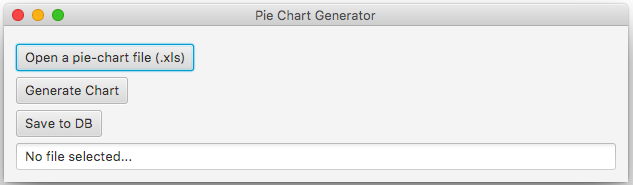
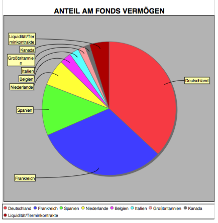

# Anevis Programming Assignment

## Pie Chart Generator

This is a pretty straight forward approach to the given assignment.

Functionalites of the App: 
Import the ```piechart-data.xls``` sheet to generate a pie chart as pdf and save the imported data into a running PostgreSQL instance.

## Quick Installation Guide

This App runs on Java 8 & PostgreSQL

Use maven to add all required dependencies.

Find & run App.java under:

```
com.anevis.chartgenerator.App.java
```

## Usage

A simple JavaFX GUI should appear. Make sure your PostgreSQL instance and a database named ```sample_db``` is running on port 5432. Check the hibernate.cfg.xml file for more details.



1. Step 1
Click on "Open a pie-chart file (.xls) and select the ```piechart-data.xls``` which is given by anevis solutions
2. Step 2
Click on "Generate Chart" to generate & export a a ```piechart.data.pdf``` to the folder where the imported file is located
3. Step 3
Click on "Save to DB" to persist the imported data into the runinng PostgreSQL DB instance

## Result:

